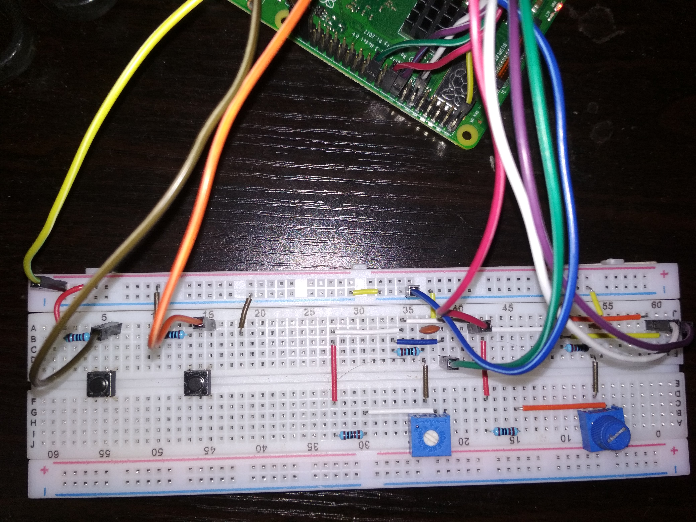

# Mouse for Raspberry Pi

Implementing a mouse via push button switches and potentiometers  

## Materials required
 - Breadboard  
 - Connecting Wires 
 - Push Button Switches  
 - Potentiometers
 - Female to Male Jumper Wires

## Description

A very simple project to demonstrate the usage of the GPIO library and dealing with analog input for a Raspberry Pi. I decided to try this out since the two Coursera courses by UC Irvine[1][2] seemed to have trivial assignments and did not provide much good practice.

Left and Right clicks are implemented by the usage of push button switches. The mouse pointer movement is simulated by two potentiometers, one each for an axis. When a particular potentiometer is turned all the way down it maps to zero value for that axis and when turned all the way up it is max value for that axis. A similar concept is actually used for [analog joysticks](https://electronics.howstuffworks.com/joystick3.htm).

The major shortcoming is that the potentiometers are not accurate and often fluctuate considerably, which leads to the mouse pointer wildly jumping around the screen.

A lot of correctional measures were tried out. The best one turned out to be updating the coordinates only if the new position was within 10 - 20 pixels of the previous coordinates. Since this updates on the order of microseconds it is expected that a human would move the pointer only a few pixels in that short period of time. Anything else is treated as a fluctuation.

## Circuit

The portion for simulating mouse clicks is trivial.

The mouse pointer movements are simulated by potentiometers are described above. A RC circuit with a variable voltage is used. This is commonly used for analog to digital conversion.

[1] : [The Raspberry Pi Platform and Python Programming for the Raspberry Pi](https://www.coursera.org/learn/raspberry-pi-platform)

[2] : [Interfacing with the Raspberry Pi](https://www.coursera.org/learn/raspberry-pi-interface)
